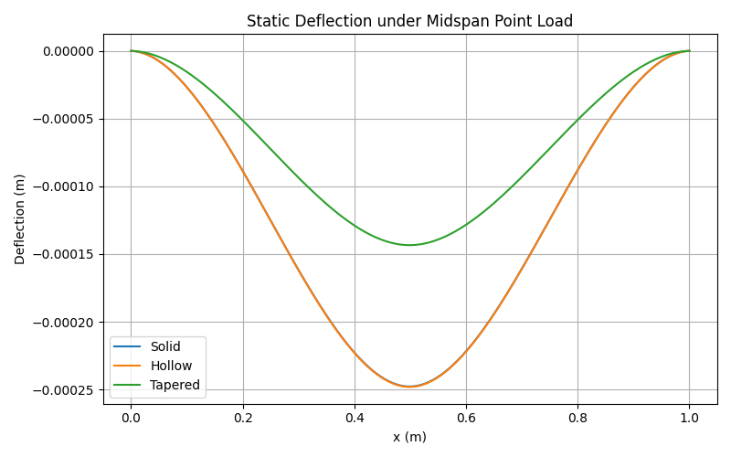

# Bridge Optimization (Euler–Bernoulli + Finite Differences)

This project models and compares lightweight bridge/beam geometries (solid, hollow, and parabolically tapered) under a midspan point load using Euler–Bernoulli beam theory and a finite-difference discretization.

## Deflection Comparison


## Key Results
See `results/results_summary.txt` for SWR, max deflection, and critical buckling load comparisons.

## How to Run
```bash
python3 -m venv .venv
source .venv/bin/activate
pip install -r requirements.txt
python src/bridge_model.py